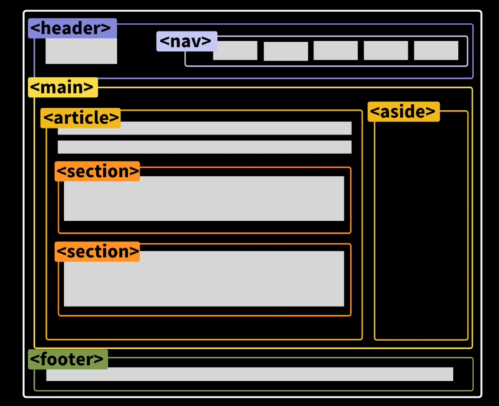

# HTML- head


## mata 태그

**부가적인 정보이고 셀프로닫는 태그이다**

```html
<head>
       <mata name="description" content="This is my websit"/>
 </head>
```

**한글,특수문자언어등입력할때 깨지지않게 해줌**

```html
 <meta charset="utf-8">
```

## lang 태그

**검색엔진에 도움을주고 사이트에 사용되는 언어를 말해줌**

```html
<html lang="kr"> </html>
```

## 웹사이트 주소록 이미지 설정

**웹사이트의 주소록의 이미지설정하는 태그임**

```html
 <link

    rel="shortcut icon"
    sizes="16x16 32x32 64x64"
    								      href="https://www.youtube.com/s/desktop/12d6b690/img/favicon.ico"

  />
```

## 링크를 복사해서 모바일로 볼떄 보여지는 소스들

```html
<meta property="og: title" content="hye min"/>  
<mata name="description" content="This is my websit" />
<mata property="og:image" content="https://www.google.co.kr/"/>
```

## 웹사이트 이름 설정하기


```html
<head>
    <title>home my first website</title>
</head>
```

# HTML- body

##  VSC단축키(shortcut) 빠르게 마크업하기        

**nav>ul>li*4>a**

```html
 <nav>
        <ul>
            <li><a href=""></a></li>
            <li><a href=""></a></li>
            <li><a href=""></a></li>
            <li><a href=""></a></li>
        </ul>
    </nav> 
```

**div.number*10>{#$}**          ( $:숫자 순서 )

```html
div.number*10>{#$} 을 입력 하면 이렇게된다
---------------------------
    <div class="number">#1</div>
    <div class="number">#2</div>
    <div class="number">#3</div>
    <div class="number">#4</div>
    <div class="number">#5</div>
    <div class="number">#6</div>
    <div class="number">#7</div>
    <div class="number">#8</div>
    <div class="number">#9</div>
    <div class="number">#10</div>
```

- **p{hello}**         -텍스트넣기

```html
<p>hello</p>
```

- **p>lorem3**     -더미용 텍스트의 단어 갯수 설정 가능

```html
<p>Lorem, ipsum dolor.</p>
```

## h 태그

**글자 굵기 (h6까지 있음)**

```html
 <h1>hello</h1> 
```

## list 태그 

**unordered list** 

```html
<ul>
    <li>beer</li>
    <li>beer</li>
</ul>
```

**ordered list** 

```html
<ol>
    <li>beer</li>
    <li>beer</li>
</ol>
```

**list item**

```html
<li>beer</li> 
```

**dl태그**

정의나 설명목록이다( dl>dt>dd)

## a태그

**a(anchor)안의 href가 Go to google.com 글자를 구글로 이동시켜준다**

(오직 a태그만이 href를 추가할수있음)

```html
<a hredf="https://www.google.co.kr/"> Go to google.com

</a>
```

## 링크를 클릭하면 새창을 열어줌

**`target="blank"` 는 글자를 클릭하면 새창으로 열어서 구글로 이동시켜줌**

```html
<a hredf="https://www.google.co.kr/" target="_blank"> Go to google.com

</a>
```

## inherit 

inherit (부모로 부터 색상을 상속받아 기본a태그의 색상을 부모의 색으로 바꿔줌)

```css
#longin-form a {
  text-align: center;
  text-decoration: none;
  color: inherit;
}
```

## img태그

**이미지태그는 셀프로 닫는 태그이다** (img태그만이 src 를 추가할수있다)

```html


```

→ 같은폴더안에 이미지 사진이 있어야됨 img/img.png 는img라는 폴더안에 img.png이름의 사진이다라는 뜻

## form / input 태그

**태그문법** <tagname attribute name="attrvalue">content</tagname>

```html
<form>
      <input required placeholder="name" type="text" />
      <input required type="password" minlength="10" />
      <input required type="submit" value="ok" />
      <input type="file" accept="pdf" />
    </form>
```

→  required placeholder 는 안에 들어갈 텍스트 글자을 입력한다 

→ required type 는 텍스트의 종류를 말한다 minlength는 길이를 말한다

→ required type="submit" value="ok" 라고입력하면 ok라는 제출하는 버튼이생김

→ type="file" accept="pdf" 라고 입력하면 파일선택 버튼과  pdf 파일만 올리기 가능하다

**버튼 코드작성하는 방법 2가지** (input/button)

```html
<body>
<input type="submit">
    or
<button></button>
</body>
```

## id 태그

id 는 고유값이어야한다 단 하나의 아이디만 가질수있다 (**id와 for의 값은 같아야됨**)


```html
 <form>
      <label for="website">webits</label>
      <input id="website" required placeholder="name" type="email" />
      <input required type="submit" value="ok" />
    </form>
```

## Sementic 태그

| 태그         | 설명                                                         |
| :----------- | :----------------------------------------------------------- |
| <article>    | 내용을 정의한다. 반복되고 재사용 가능한 것을 묶어 준것       |
| <aside>      | 페이지 콘텐츠를 제외한 콘텐츠를 정의한다. 링크, 광고, 사이드바 표시 등. |
| <details>    | 사용자가 보거나 숨길 수있는 추가 세부 정보를 정의한다.       |
| <figcaption> | <figure> 요소에 대한 캡션을 정의한다.                        |
| <figure>     | 일러스트레이션, 다이어그램, 사진, 코드 목록 등과 같은 자체 포함 된 콘텐츠를 지정한다. |
| <footer>     | 문서 또는 섹션의 바닥글을 지정한다.주로 저작권, 연락처 정보 등 내용이 삽입되며<header>, <section>, <article> 등 다른 레이아웃 사용가능. |
| <header>     | 문서나 섹션의 머릿글을 지정한다.사이트 맨 위쪽이나 왼쪽에 사용하며 헤더 안에 <form> 태그를 이용, 검색창을 넣거나 <nav>태그를 이용해 사이트메뉴를 넣는다. |
| <main>       | 문서의 주요 내용을 지정한다.                                 |
| <mark>       | 강조표시된 텍스트를 정의한다.형광펜을 칠한 것처럼 노랗게 칠해진다. |
| <nav>        | 네비게이션 링크를 정의한다. 같은 사이트내의 링크나 다른 사이트로의 링크들의 모음이다. |
| <section>    | <header>, <footer>와 함께 문서의 구역을 정의한다. <section>안에 <section>을 넣을 수도 있고, <article>을 이용해 내용을 넣는다. |
| <summary>    | <details> 요소를 위한 눈에 보이는 제목을 정의한다.           |
| <time>       | 날짜/시간을 정의한다.                                        |

**div= header,main,footer**

```html
 <body>
    <header>
      <h1>the hyemin times</h1>
    </header>
    <main>hello</main>
    <footer>&copy: 2020 n.c</footer>
  </body>
```

**한줄로만 출력되게 해줌  span= address** 

```html
 <span>123 Road Altavista</span>
```



## nav

nav (navigation)

```html
<body>
<nav>
 <ul>
  <li>
   <a href=""></a>
  </li>
</ul>
</nav>
</body>
```

→ 보통 nav는 이런식으로 코드가 짜여져 있다


# CSS

## css를 HTML에 추가하는 2가지 방법

```html
<head>                                   
    <style>
        h1{
        color: yellowgreen;
        font-weight: 1000;
        text-decoration: underline;
        font-style: italic;
        font: size 50px;
        }
    </style>
</head> 
```

```html
<head>
	  <link rel="stylesheet" href="css/styles.css"/>
</head>
```

→ css는 태그{속성이름:속성값;}

→ 속성이름은 띄어쓰기 하면안됨 공백은 `-` 이걸로채움

→ css 코드순서는 결과에 영향을 준다 (적용되는건 마지막 코드가 적용됨)

## 공통css @import

```css
@import url("https://fonts.googleapis.com/css2?family=Open+Sans:wght@400;600&display=swap");
@import "reset.css";
@import "variables.css";
/* components */
@import "components/status-bar.css";
@import "components/nav-bar.css";
/* screens */
@import "screens/login.css";

body {
  font-family: "Open Sans", sans-serif;
}
```

→ styles.css 파일에는 모든 화면에 적용되는 css를 넣도록 하자 다른것들은 따로 - @import하기 

→첫줄에는 font를 import 하고 그다음에는 style를 reset하고 그리고 variables.css를 import하였다.(순서가 바뀌면 적용이 안됨, import의 우선순위가 바뀌기 때문)


## block/inline 속성

```
block요소들은 옆에 아무도 올수없다(대부분 요소가 block이다, div,p..)

inline은 옆에 다른요소가 올수있다,같은줄에 위치할수있음 (span,a,image,code..)

inline은 높이와 너비가 없다(내용이 있어야 모양이보임) - block는 높이와 너비가 있다
```

- disply: block 는 box 속성을 가짐, 그래서 옆에 아무도 올수 없고 세로로 나열함   ex) div
- disply: inline-block는 box 속성을 가짐, 그래서 block속성을 유지할수있게 해주고 가로로 나열함  (withd,height 적용 가능)
- **inline-block** 와 **inline** 차이점: inline은 box가 아니다 그래서 너비와 높이가 적용이 안된다(두요소는 children에게적용해야함)

**block/line속성 바꾸기** (div가 inline 속성이됨)

```html
<head>
    <style>
        div{display:inline;}
    </style>
</head>

```

## margin

**margin은 box의 border의 바깥에 있는 공간이다**  

```html
<style>
    body 
    {   
        margin: top 10px;
        margin-left: 300px;
        background-color: thistle;}
</style>
```

```html
margin:0px;                   4면다적용됨
margin:20px 15px;             (상하 좌우)  
margin:20px 15px 50px 30px;   시계방향순서(위-오-아래-왼)
margin: auto;                 수평으로 자동으로 마진줌으로 정렬해줌(수직은 작동안됨)
```

→ body와 div 경계가 같다면  위아래margin은 똑같이 움직임 (collapsing margins현상)

## padding

**Padding은 box의 경계로부터 안쪽에 있는 공간이다**  (margin과 반대개념)

```html
<style>
 body {
        margin: 20px;
        padding: 20px;
        background-color: thistle;
      }
</style>
```

## border

**border는 box의 경계이다**  (* : 전체 적용한다는 뜻)  

```html
<head>
    <style>
        *{
            border: 2px solid black;
        }
        dive{
            
            border: 2px soild black;
        }
    </style>
</head>
```

**inline 에게 네면다 margin주는 방법**

```
inline은 높이와 너비가 없다

->margin : 좌우만 적용됨 / padding은 사방에 가질수있음
```

→ margin을 위아래 주고싶으면  display: block; 을 적용해야됨

## box-sizing: border-box

```css
.nav {
  position: fixed;
  bottom: 0;
  width: 100%;
  background-color: #f9f9fa;
  padding: 20px 50px;
  box-sizing: border-box;
  border-top: 1px solid rgba(177, 177, 177, 0.2);
}
```

→  css에게 padding 20px 50px를 적용했지만 나의 box사이즈를 늘리지 말고 

그대로 둬라고 명령하는것 (padding값만큼 내box를 늘리지 말라고하는 것임)

## id, class 만드는 규칙

1. BEM(Block Element Modifier)규칙

```html
 <body>
    <div class="status-bar">
      <div class="status-bar__column"></div>
    </div>
  </body>
```

→ class="status-bar__column"인 이유: class="status-bar"안에  column이라는 뜻으로써

​	쉽게 알수있게 하기위해 작성했음, 

→ css작성할때 id인가 class 인가 헷갈리기 때문에 위에 방법으로 보통 html은 class로 모두 작성함

## id

**id 명을 통해 가르키는법 (#)**   

```html
<head>
    <style>
      #first 
        {
        background-color: whitesmoke;
        width: 150px;
        height: 150px;
        }
    </style>
</head>

<body>
    <div id="first">
    </div>
</body>
```

**id를 한군데로 모으기**

```html
<style>
      body {
        margin: 20px;
      }
      span {
        background-color: teal;
      }
      #tomato,
      #tomato2,
      #tomato3
      {
          background-color: tomato;
      }
      }
    </style>
  </head>
  <body>
    <span>hello</span>
    <span id="tomato">hello</span>
    <span>hello</span>
    <span id="tomato2">hello</span>
    <span>hello</span>
    <span id="tomato3">hello</span>
    <span>hello</span>
  </body>
```

## class

**(.) 온점은 class 명이다**

```html
 <head>
    <style>
      .tomato 
        {
        background-color: tomato;
        color: white;
        padding: 5px 10px;
        border-radius: 10px;
        }
    </style>
  </head>
  <body>
    <span>hello</span>
    <span class="tomato">hello</span>
    <span>hello</span>
    <span class="tomato">hello</span>
    <span>hello</span>
    <span class="tomato">hello</span>
    <span>hello</span>
  </body>
```

```html
#tomato : id="tomato"
.tomato : class="tomato"
```

**class의 이름은 여러개 합치기 가능하다** (btn + teal+ tomato)

```html
   <style>
      body {
        margin: 20px;
      }
      .btn {
        padding: 5px 10px;
        border-radius: 10px;
      }

      .tomato {
        background-color: tomato;
        color: white;
      }
      .teal {
        background-color: teal;
      }
    </style>
  </head>
  <body>
    <span class="btn teal">hello</span>
    <span class="btn tomato">hello</span>
    <span class="btn teal">hello</span>
    <span class="btn tomato">hello</span>
    <span class="btn teal">hello</span>
    <span class="btn tomato">hello</span>
    <span class="btn teal">hello</span>
  </body>
```

## flex

**flex는 내가 원하는곳에 박스를 둘수있게 해줌** 

```html
<head>
    <style>
      body {
        height: 100vh;
        margin: 20px;
        display: flex;
        justify-content: space-between;
        align-items: center;
      }
      div {
        background-color: teal;
        width: 300px;
        height: 300px;
      }
    </style>
  </head>
  <body>
    <div></div>
    <div></div>
    <div></div>
  </body>
```

→ 'display : flex' 는 자식에게 명시하지않고 **부모에게 명시**한다 (div의 부모는 body이다)

→ justify-content(주축) / align-items(교차축)

→ **주축**은 기본적으로 ''수평''이다 (row로 적용되어있음) / **교차축**은 ''수직''이다

→ 'height: 100vh;'는 교차축의 값을 적용시켜준다

- 100vh라고 하면 body가 화면의 100%인것이다 

  100%영역안에서 교차축(수직)이 움직임(전체화면의 크기를 가짐)

- height 를 주지않으면 기본값 영역이 작아서(body의 크기가 작아)

  움직여도 표시가 안남

- vh는 화면크기에 따라 비율조정해줌

## main axis and cross axis 

- flex container의 flex-direction **기본값은 row** 이다
  - row (행) 가로 / column(열) 세로
- flex-direction : row    =     main axis : 가로     =   기본방향 :가로   = cross axis : 세로
- **justify-content**은  **main axis방향**(가로축)으로 item옯길때 사용
  - justify-content: space-between (box사이에 공간을 줌)

​                                          space-around (box주변 옆공간을 같게 만듦)

-  **align-items**은 **cross axis 방향으로**(세로축) item옮길때 사용
   - align-items: stretch (세로로 늘어남 그래서 children의 높이 값을 주면 안됨) 
   - align-items: center (부모와 아이의 높이가 같으면 center인지 구분 안감(이미 센터이다) 그래서 부모에게 높이를 주면 구분이감)

## flex-direction

flex-direction: column 주축과 교차축의 설정이 반대로됨

flex-direction : column   =   main axis : 세로   =   cross axis : 가로

- justify-content :세로축
- align-items : 가로축


```html
 flex-direction: column;
```

```html
 <style>
      body {
        height: 100vh;
        margin: 20px;
        display: flex;
        justify-content: space-between;
        align-items: center;
        flex-direction: column;
      }
      div {
        display: flex;
        justify-content: center;
        align-items: center;
        font-size: 20px;
        color: white;
        width: 300px;
        height: 300px;
        background-color: teal;
      }
      #second {
        background-color: yellow;
      }
    </style>
  </head>
  <body>
    <div>1</div>
    <div id="second">2</div>
    <div>3</div>
  </body>
```

→ column은 주축은 수직이되고 교차축이 수평이됨(기본설정이 반대로됨)

→ display: flex;  <-설정을 먼저 해줘야 나머지  밑에것들도 작동됨

- justify-content: center;
- align-items: center;
-  flex-direction: column;

## flex-wrap

```html
flex-wrap: wrap;
```

wrap을 하게되면 명시된 사이즈로 반영이된다 

ex) 한줄에 들어가는 만큼 최대한 집어넣고 그게되지않으면 다음줄로 옮겨진다

## white-space

```scss
white-space: nowrap;
```

→  줄 바꿈 하지않는다

## 레이아웃 정리 (flex box)

- **flex-direction**(정렬할 방향을 지정)
  
  row(기본값)/column
  
  - row-reverse는 가로축에서 반대 반향으로 시작하는 것 (오른쪽에서 시작 ←)
  - column-reverse는 세로축에서 반대반햐응로 시작하는 것 (밑에서부터 시작 ↑)
  
- **justify-content** (수평)

​		**flex요소들을** 가로선 상에서 정렬

- `flex-start`: 요소들을 컨테이너의 왼쪽으로 정렬합니다
- `flex-end`: 요소들을 컨테이너의 오른쪽으로 정렬합니다
- `center`: 요소들을 컨테이너의 가운데로 정렬합니다
- `space-between`: 요소들 사이에 동일한 간격을 둡니다
- `space-around`: 요소들 주위에 동일한 간격을 둡니다

- **align-items**(수직)

  **flex요소를** 세로선 상에서 정렬한다

- `flex-start`: 요소들을 컨테이너의 꼭대기로 정렬합니다

- `flex-end`: 요소들을 컨테이너의 바닥으로 정렬합니다

- `center`: 요소들을 컨테이너의 세로선 상의 가운데로 정렬합니다

- `baseline`: 요소들을 컨테이너의 시작 위치에 정렬합니다

- `stretch`: 요소들을 컨테이너에 맞도록 늘립니다

---------------------------------------------------------------------------------------

- **order** (순서)
  flex요소의 **순서**를 지정한다 
  
- order의 기본 값은 0이며, 양수나 음수로 바꿀 수 있습니다
  
- -2 >-1 >0 >1 >2    ( -2가 제일 우선순위이다  )

- ex) .red{order:-1;}
  
- **align-self**(개별)
  지정된 align-items 값을 무시하고 flex 요소를 세로선 상에서 정렬한다

  **부모에게 반드시 높이**를 줘야 적용가능함, 오직 **자식**에게만 줄수있는 기능이다, box에게만 해당된다

  - 개별 요소에 적용할 수 있는 또 다른 속성입니다
  - 그 값들은 지정한 요소에만 적용됩니다
  
- **align-content** (줄 간격)

  세로선 상에 여분의 공간이 있는 경우 **flex컨테이너 사이의 간격을 조절**함

   위아래 박스들 사이공간을 수정할때 사용 (line 수정이다) , cross axis이다

  align-content: flex-start 는 줄 나누는 공간이 없어진다 

  - `flex-start`: 여러 줄들을 컨테이너의 꼭대기에 정렬합니다.
  - `flex-end`: 여러 줄들을 컨테이너의 바닥에 정렬합니다.
  - `center`: 여러 줄들을 세로선 상의 가운데에 정렬합니다.
  - `space-between`: 여러 줄들 사이에 동일한 간격을 둡니다.
  - `space-around`: 여러 줄들 주위에 동일한 간격을 둡니다.
  - `stretch`: 여러 줄들을 컨테이너에 맞도록 늘립니다.

- **flex-wrap**
  nowrap: 모든 요소들을 한 줄에 정렬합니다.
  wrap: 자식의 크기를 유지하고 요소들을 여러 줄에 걸쳐 정렬합니다.
  wrap-reverse: 요소들을 여러 줄에 걸쳐 반대로 정렬합니다.

  ​           wrap한 상태에서 원래값에서 반대반향으로 시작함(  2 →      

  ​                                                                                                    1 →   )

- **flex-flow**
  **flex-dirction 와 flex-warp** 두개의 속성들을 합친것
  ex)flex-flow: column wrap; (띄어쓰기로 구분함)
  
- `flex-direction`과 `flex-wrap`이 자주 같이 사용되기 때문에, `flex-flow`가 이를 대신할 수 있다

- `flex-flow:column wrap` 세로선상에서 여러줄 걸쳐 정렬

- ` flex-flow: row wrap` 가로선상에서 여러줄 걸쳐 정렬

---------------------------------------------------------------------------------------


- **flex-grow**

  주변에 자기가 차지할 수 있는 공간을 가지고 **그값만큼 커진다** ,공간이 없으면 커질수없음 (주변공간을 가져감)

  기본 값은 flex-grow:0 이다

  ```css
    .project {
      flex-grow: 1;
    }
  ```

  - 여백신경안쓰고 화면을 1비율로 꽉채워줌

- **flex-shrink**

  **자식**에게만 줄수있는 명령어다 

  flex-shrink:1 기본값이다 (숫자가 늘어날수록 지정된 박스는 화면이 작아질때 다른박스들 보다 그 값만큼 더 **작아진다** )

## position:fixed

position:fixed;  위치를 고정시켜줌

```html
   <style>
      body {
        height: 1000vh;
        margin: 20px;
      }
      div {
        width: 300px;
        height: 300px;
        color: white;
        background-color: teal;
      }
      #different {
        top: 5px;
        left: 200px;
        position: fixed;               // 위에서 5px 왼쪽에서 200px 고정됨
        background-color: wheat;
        width: 350px;
      }
    </style>
  </head>
  <body>
    <div></div>
    <div id="different"></div>
  </body>
```

→ top,left,right,bottom 하나라도 추가하면 맨앞에 레이어가 된다(margin, block을 신경안씀)

## position: relative

```html
 <style>
      body {
        height: 1000vh;
        margin: 50px;
      }
      div {
        width: 300px;
        height: 300px;
        background-color: wheat;
      }
      .green {
        top: -10px;
        position: relative;
        background-color: teal;
        height: 100px;
        width: 100px;
      }
    </style>
  </head>
  <body>
    <div>
      <div class="green"></div>
    </div>
  </body>
```

→ top,right,left,bottom을 이용해서 요소의 처음 놓인 자리에서 상하좌우로 움직임 (자기자리에서 옮겨간다)

## position: absolute

```html
  <style>
      body {
        height: 1000vh;
        margin: 50px;
      }
      div {
        width: 300px;
        height: 300px;
        background-color: wheat;
        position: relative;
      }
      .green {
        bottom: 0px;
        position: absolute;
        background-color: teal;
        height: 100px;
        width: 100px;
      }
    </style>
  </head>
  <body>
    <div>
      <div class="green"></div>
    </div>
  </body>
```

→ body가 기준이(부모가기준이됨) 되어 움직임  (상위 태그안에서 옮겨간다)

→ 기준이되었으면 하는 곳에 position: relative; 을 입력해주면 그곳이 기준이되고 부모가됨

## z-index 

```css
#chat-screen .alt-header {
  top: 10px;
  z-index: 1;
}
```

→ layer 순서이다

```scss
header {
  z-index: 1;
  position: fixed;
```

→ position을 주면 요소끼리 겹치기 때문에 z-index로 layer를 설정해준다

## **first-child** (pesudo selector)

**first-child**

```css
div:first-child {
        background-color: tomato;
      }
      div:last-child {
        background-color: teal;
      }
```

→ div : first-child{      }는 첫번째 div태그를 선택한다는 뜻

##  tag:nth-child()

 div:nth-child()

```css
div:nth-child(2),
      div:nth-child(4) {
        background-color: teal;
      }
```

→ div:nth-child( 2 ){      }는  2번재 div태그를 선택한다는 뜻

## tag:nth-child(even) -짝수

```css
span:nth-child(even){
         background-color: teal;
     }
```

## tag:nth-child(odd) -홀수

```css
span:nth-child(odd){
         background-color: teal;
     }
```

##  span:nth-child(3n + 1) - 3번째마다 선택하기

```css
 span:nth-child(3n + 1) {
        background-color: teal;
      }
```

## 부모안에있는 자식에게 css적용하기          

```html
<style>
p span{
        color: teal;
    }
</style>
 <body>
      <p>
          ldkfgkldfkgflgkl kfsldfkdsl sfklgkslfkglfsgk
          <span>inside</span>
      </p>
  </div>
    </body>
```

→ p span{      }    p:부모 span:자식

## 부모 바로 밑에 자식에게만 css적용하기

```html
 <style>
      div > span {
        text-decoration: underline;
      }
    </style>
  </head>
  <body>
    <div>
      <span>hello</span>
      <p>
        Lorem ipsum dolor sit amet consectetur adipisicing elit.
        <span>inside</span>
      </p>
    </div>
  </body>
```

→ div > span{        } :  div:부모  span:자식

## 다음으로 오는 요소에게 CSS 적용하기(형제찾기) 

```html
<style>
      p + span {
        text-decoration: underline;
      }
    </style>
  </head>
  <body>
    <div>
      <p>lkkkkkkkkkk</p>
      <span>hello</span>
    </div>
  </body>
```

p + span{     }   p다음으로 오는 형제 span에게 CSS적용

## input태그의 attribute를 이용해서 css 적용하기

attribute  (name 포함한 모든 영역은 분홍색 적용)

```html
 <style>
      input {
        border: 1px solid wheat;
      }
      input:required {
        border-color: tomato;
      }
      input[placeholder~="name"] {
        background-color: pink;
      }
    </style>
  </head>
  <body>
    <div>
      <form action="">
        <input type="text" placeholder="First name" />
        <input type="text" placeholder="Last name" />
        <input type="password" required placeholder="password" />
      </form>
    </div>
  </body>
```

 input[placeholder~="name"]{       }          (~= "  "   ->    "   "을 포함한 모든것 )

## []

[]는 상위태그

(ex: <form>)안에 여러개 하위태그(ex: <input>) 중에서 

특정 속성(type="subit")을 가지고 있는 input태그에만 CSS를 적용하고 싶을때
 `not([type="submit"])`을 적용하게 되면 type이 "submit"이 아닌 애들만 적용되도록 함

## not 

not  (뭔가가 적용되는 걸 원하지 않을때)

```css
#longin-form input:not([type="submit"]) {
  border-bottom: 1px solid rgb(0, 0, 0, 0.2);
  transition: border-color 0.3s ease-in-out;
}
```

→ submit 아닐때만 밑에 코드를 적용시킨다라는 뜻

## **active** 태그(States 태그)

**active** (클릭하면 색바뀜)

```html
<style>
      button:active {
        background-color: tomato;
      }
    </style>
  </head>
  <body>
    <div>
      <button>Hello</button>
    </div>
  </body>
```

## **hover** 태그(States 태그)

**hover** (마우스를 위에 두면 색이 바뀜)

```css
 button:hover {
        background-color: tomato;
      }
```

```css
.major__icon:hover i {
  color: var(--color-pink);
  transform: rotate(-30deg) scale(1.1);
}
```

- major__icon에 호버를 하면 i에게만 스타일을 적용한다

## **focus** 태그(States 태그)

**focus** (키보드로 선택하면 색이 바뀜)

```css
  input:focus {
        background-color: tomato;
      }
```

## **visited** 태그(States 태그)

**visited** (방문한 링크는 색이 바뀜)

```css
 a:visited {
        color: tomato;
      }
```

## focus-within 태그(States 태그)

**focus-within** (자식의 상태에 따라 부모가 바뀐다)

```css
 <style>
      form:focus-within {
        background-color: tomato;
      }
    </style>
  </head>
  <body>
    <form action="">
      <input type="text" name="" id="" />
    </form>
  </body>
```

→ form:부모  input:자식 / input중 하나가 focus가되면 form의 모습이 바뀐다

**반대로 부모의 상태에 따라 자식이 바뀐다**

```html
 <style>
      form:hover input {
        background-color: tomato;
      }
      form:hover input:focus {
        background-color: tomato;
      }
    </style>
  </head>
  <body>
    <form action="">
      <input type="text" name="" id="" />
    </form>
  </body>
```

→ form:hover input {  }  (부모 form이 hover되면 자식 input의 상태가 바뀐다)

→ form:hover input:focus {  } (부모form이 hover이되고 자식input이 focus가 되면 자식 

상태가 이바뀜)

## placeholder에게 css 적용하기 ::

input::placeholder {   }          (input에 있는 placeholder을 바꿔줌)

```html
<style>
      input::placeholder {
        color: tomato;
      }
    </style>
  </head>
  <body>
    <form action="">
      <input type="text" placeholder="name" />
    </form>
  </body>
```

## 드래그하면 css 적용시키기

 p::selection {  }     (p를 드래그하면 스타일 해줌)

```html
 <style>
      p::selection {
        background-color: yellowgreen;
        color: white;
      }
    </style>
  </head>
  <body>
    <p>
      Lorem ipsum dolor sit amet consectetur adipisicing elit. Atque, adipisci
      esse fugit illum omnis quaerat tempore error est doloremque rerum vel
      blanditiis nobis animi optio. Vitae exercitationem animi molestiae culpa!
    </p>
  </body>
```

## 글자의 첫번째 글자만 스타일해줌

 p::first-letter {  }       (p태그의 L 만 css 적용됨)

```html
 <style>
      p::first-letter {
        font-size: 100px;
        background-color: yellowgreen;
        color: white;
      }
    </style>
  </head>
  <body>
    <p>
      Lorem ipsum dolor sit amet consectetur adipisicing elit. Atque, adipisci
      esse fugit illum omnis quaerat tempore error est doloremque rerum vel
      blanditiis nobis animi optio. Vitae exercitationem animi molestiae culpa!
    </p>
  </body>
```

## rgb

Color     

```html
<style>
    p {
        background-color: rgb(252, 206, 0, 0.8);
    }
</style>
```

→ #fff:흰색, #000:블랙  rgb(252, 206, 0, 0.8)에서 0.8은 투명도이다.

## :root  변수선언

```css
  :root {
        --main-color: #fbbc05;
        --default-border: 1px solid var(--main-color);
      }
      p {
        background-color: var(--main-color);
      }
      a {
        color: var(--main-color);
        border: var(--default-border);
      }
```

`:root {--이름지정-이름: 값  ;}`

## 데이터 속성

**데이터 속성**  [`data-*`속성](https://developer.mozilla.org/en-US/docs/Web/HTML/Global_attributes/data-*)

```css
<article
  id="electric-cars"
  data-columns="3"
  data-index-number="12314"
  data-parent="cars">
...
</article>
```


##  transition

transitions (어떤 상태에서 다른 상태로 가는 변화)  

```html
 <style>
      a {
        color: white;
        background-color: tomato;
        text-decoration: none;
        padding: 3px 6px;
        border-radius: 5px;
        font-size: 50px;
          
        transition: background-color 10s ease-in-out, 
            color 5s ease-in-out;
          
          or transition: all 5s ease-in-out; (<-변화하는 모든것을바꿀때)
      }
      a:hover {
        color: tomato;
        background-color: wheat;
        border-radius: 30px;
      }
    </style>
  </head>
  <body>
    <a href="#">Go home</a>
  </body>
```

→ transitions이라는 속성은 state가 없는 요소에 있어야된다 

→ 변화를 시키고 싶다면 state에도 변화할것을 적어야 되다(hover에 변할것을 적기)

→ https://matthewlein.com/tools/ceaser 이사이트를 통해서 여러효과를 볼수있음

→**transition 기능이 transform의 기능을 비디오처럼 보이게해줌**

> 코드를 복붙 사용가능함 : transition: all 2s ->복사한거 cubic-bezier(0.95, 0.05, 0.795, 0.035);

## transform

```css
transform: translateX(100px);   //X축으로 이동
transform: translate(50px, -20px);  //X,Y축으로 이동
transform: scale(1.2);  //1.2배 커진다
transform: rotate(45deg) // 45도로 돌아감
transform: translateX(100px) scale(1.2)  rotate(45deg) //같이 써도됨

x는 오르쪽으로 갈수록 값이 커진다, y는 밑으로 갈수록 값이 커진다.
```

```html
 <style>
      img {
        border: 10px solid black;
        border-radius: 50%;
        transition: transform 5s ease-in-out;
      }
      img:hover {
        transform: rotatex(90deg) scale(0.5);
      }
    </style>
  </head>
  <body>
    
  </body>
```

> https://developer.mozilla.org/ko/docs/Web/CSS/transform 이사이트에서 복붙가능

### - 가운데 정렬하기

```
.box{
position: absolute;
width: 200px;
height: 200px;
background-color: red;
top: 50%;
left: 50%;
transform: translate(-50%,-50%);
}
```

box사이즈가 딱 화면의 절반이 아닐때 가운데로 맞추기위해서는 

`position: absolute` 으로 화면가운데로 맞추고 box의 가운데가 화면의 가운데로 

일치하기 위해서는 `transform: translate(-50%,-50%)` 을 사용해서 맞춰줘야한다.

## keyframes  from to  

```html
 <style>
      @keyframes hyemin {
        from {
          transform: rotateX(0);
        }
        to {
          transform: rotateX(360deg);
        }
      }
      img {
        border: 10px solid black;
        border-radius: 50%;
        animation: hyemin 5s ease-in-out infinite;
      }
    </style>
  </head>
  <body>
    
  </body>
```

→ 만든 애니메이션 실행시키기 위해서 입력하기:

 `animation: hyemin 5s ease-in-out infinite;`

→ 애니메이션 만드는 규칙:  @keyframes 아무이름{ form{      }to{     } } 

→애니메이션의 마지막 값을 계속 가지고있게해줌: `animation:hyemin 1s ease-in-out forwards;`

 **animation-delay:** 

```css
animation-delay: 1s;
```

→ 애니메이션의 시작을 지연시켜준다

**will-change**

```css
.open-post__heart-count:hover i {
  will-change: transform;
  animation: heartbeat 1s linear infinite;
}
```

→ 브라우저에게 어떤 것이 변할 것인지 말해주고 일종의 브라우저에게 렌더링 힌트를 주면서 도와주는 역할임 

(이게 없으면 애니메이션 효과는 불안정하게 흔들림)

## keyframes %

```html
 <style>
      body {
        display: flex;
        height: 100vh;
        align-items: center;
        justify-content: center;
      }
      @keyframes hyemin {
        0% {
          transform: rotateX(0);
        }
        50% {
          transform: rotatey(180deg) translatey(100px);
          border-radius: 0%;
          border-color: chartreuse;
          opacity: 0;
        }
        100% {
          transform: rotateY(0);
        }
      }
      img {
        border: 10px solid black;
        border-radius: 50%;
        animation: hyemin 5s ease-in-out infinite;
        width: 500px;
      }
    </style>
  </head>
  <body>
    
  </body>
```

→ 0% 50% 100% (애니메이션 되돌아가는 것도 순서대로 돌리기)

→ https://animista.net/play/basic/flip-2   transform효과 여러개있음


## media Queries (스크린의 사이즈를 알수있음)

```html
 <style>
      body {
        display: flex;
        height: 100vh;
        align-items: center;
        justify-content: center;
        flex-direction: column;
      }
      div {
        background-color: teal;
        width: 200px;
        height: 200px;
      }
      @media screen and (max-width: 600px) {
        div {
          background-color: tomato;
        }
      }
      @media screen and (min-width: 601px) and (max-width: 800px) {
        div {
          background-color: wheat;
        }
      }
      @media screen and (min-width: 1200px) {
        div {
          background-color: turquoise;
        }
      }

      @media screen and (orientation: landscape) {
        div {
          background-color: black;
        }
      }
      @media screen and (orientation: portrait) {
        div {
          background-color: darkorchid;
        }
      }

      span {
        font-size: 36px;
      }
      @media screen and (orientation: landscape) {
        span {
          display: none;
        }
      }
    </style>
  </head>
  <body>
    <div></div>
    <span>please flip your phone</span>
  </body>
```

→ @media screen and (max-width: 600px){ 요소 { css } }  => 너비가 600이하 까지만 적용함

→ media query는 and로 연결해서 쓰면됨

​    @media screen **and** (min-width: 601px) **and** (max-width: 800px)

→ 가로모드: (orientation: landscape) 세로모드:(orientation: portrait) 

→  display: none; =>화면에 안보이게함

**@media print 프린트 할때만 지정색 정할수있음**

```css
@media print {
        body {
          background-color: tomato;
        }
      }
```

# +CSS

## cursor(마우스)

Cursor (포인터 모양을 다르게 해줌)

```css
 cursor: pointer;
```

## 대문자로 만들기

모든 글자를 대문자로 만든다 

```css
.title {
  text-transform: uppercase;
}
```

## letter-spacing (글자간격)

```scss
h1{
  letter-spacing: 5px;
}
```

## line-height (문장간의 아래위 높이를 조절)

```scss
h3,
p {
width: 70%;
line-height: 1.2;
text-align: justify;
}
```

### - 가운데 정렬

```css
h1{
text-align: center; //수평만 적용됨
line-height: 100px //글자의 높이를 부모의 높이만큼 주면됨 (한줄일때 사용하는 해키한 방법)
}
```

- text-align은 수평만 정렬이 적용되기때문에 텍스트의 높이line-height를 박스만큼 값을 주면 알아서 가운데로 간다.

## text-align (문장 정렬)

```scss
  h3 {
    text-align: center;
  }
```

→ 문장의 기준을 설정할수있다 (수직은안됨)

→ 텍스트 뿐만 아니라 버튼과 같은 인라인요소들을 정렬할때 쓸 수 있음

##  linear-gradient (그라데이션)

```scss
 .movie {
    background:linear-gradient(to bottom,
        rgba(0, 0, 0, 0.1) 10%,
        rgba(0, 0, 0, 0),
        rgba(0, 0, 0, 0),
        rgba(0, 0, 0, 0),transparent),$red;
        }
```

→ 4가지 변화를 가지고 있는 투명도 그라데이션이, red색상 위에서 이루어져 직선으로 밑으로 내려가는 그라데이션

### - 그라데이션과 배경이미지 같이 주기 

```scss
.hero {
  height: 100vh;
  background-image: linear-gradient(rgba(0, 0, 0, 0.4), rgba(0, 0, 0, 0.4)),
    url("");
  background-size: cover;
```

→ 배경이미지를 넣고 바로위에 그라데이션 효과를 줄수있다 

 → background-size으로 그림을 지정한 너비와 높이에 맞게 확대 축소 할수있다

## background-image

``` scss
background-image: url('');  //url을 이용해서 사진넣기
background-repeat: no-repeat;  //사진반복안함
background-position: center;  //사진의 센터가 보이도록 하기
bacckground-size: cover;  //지정한 넓이만큼 사진이 꽉차게 하기
```

background-image를 이용해서 배경이미지를 가져온다

background-size를 이용해서 이미지의 너비 높이 다 확대하거나 축소햇거 이미지를 맞춰줌(cover)

## overflow

```scss
overflow: hidden;
```

→ 콘텐츠가 너무 커서 요소의 블록 서식 맥락에 맞출 수 없을 때의 처리법을 말함, hidden은 숨기기이다

## filter 

```css
 &:filter: blur(50px);
```

→ 필터로 블러처리하기

# Grid

grid design는 부모에게 해야됨  ( display:grid )

##  grid-template-columns (열)

```css
.father {
  display: grid;
  grid-template-columns: 250px 500px 250px;
}
```

→ column너비(좌우) 값을 나타냄 

##  grid-template-row (행)

```css
.father {
  display: grid;
  grid-template-rows: 250px 100px 300px 50px;
}
```

→ row너비(상하)값을 나타냄

## grid-template (행/열)

```css
grid-template: 50% 50% / 200px; 
```

→ grid-template작성하는법 (여기서는 repeat 함수 적용 안된다 )

→ 예를 들어, `grid-template: 50% 50% / 200px;`는 ( grid-template: row row/column)

​     각각 50% 인 두개의 행(row)과 200px 너비의 한개의 열(column)의 그리드를 생성한다는 뜻

```css
grid-template: auto 50px/ 1fr 4fr
```

→ auto는 가능한 많은 행을 많들고 50px는 맨마지막 행에 값을 적용한다 /1fr 4fr는 열이다 

## gap (간격)

```css
.father {
  display: grid;
  grid-template-columns: 250px 250px 100px;
  grid-template-rows: 100px 50px 300px;
  row-gap: 10px;
  column-gap: 10px;
}
```

→ row-gap (상하간격)    / column-gap (좌우간격)  / gap(상하좌우간격)

### - gap에게 색상 주는 방법

gap에게는  따로 color를 줄수가 없다.그렇게 때문에 body의 배경색과 grid의배경색이랑 grid-gap을 잘활용해서 gap에게 색을 준 것처럼 표현할수있다 

```scss
body {
  background-color: $bg;
  display: grid;
  grid-template-columns: 1.5fr 1.9fr 1.5fr;
  grid-template-rows: 1fr 5fr 1fr;
  gap: 1px;
  & > * {
    background-color: white;
    color: $bg;
  }
```

## repeat(몇번반복한건지 갯수 ,값)

```css
.grid {
  display: grid;
  grid-template-columns: repeat(4, 200px);
```

→ 200px 값으로 4번 반복한다는 뜻

## grid-template-areas

```css
.grid {
  display: grid;
  grid-template-columns: repeat(4, 200px);
  grid-template-rows: 100px repeat(2, 200px) 100px;
  grid-template-areas:
    "header header header header"
    "content content content nav"
    "content content content nav"
    "footer footer footer footer";
}

.header {
  background-color: greenyellow;
  grid-area: header;
}
.content {
  background-color: blue;
  grid-area: content;
}
.nav {
  background-color: darkgoldenrod;
  grid-area: nav;
}
.footer {
  background-color: salmon;
  grid-area: footer;
}
```

→ grid-area에 있는 이름과 grid-template-areas가 같아야됨

→ class와 별개로  grid-area로 이름 지정해줘야됨

## grid-column-start  /  grid-column-end 그리드요소의 시작끝 위치 지정

```css
.content {
  background-color: blue;
  grid-column-start: 1;     // column시작이 1위치에 한자리만 차지한다는 뜻
  grid-column-end: 4;
  grid-row-start: 2;
  grid-row-end: 4;
}
```

→ start와 end 는 column이 아니고 line을 얘기하는거다

→ 1번재 줄에서 시작하고 5번째 줄에서 끝난다는 이야기이다 column순서와 무관함

→ 이걸사용하면 areas 안하게됨

## grid-row  /  grid-column    (시작/끝)

```css
div{
  grid-row: 2/4;   
}
div{
 grid-column: 1/-1;
}
```

→ 몇개의 line이 있는지 신경쓰지 않고 적용할수있다 

→ 1(처음시작)  / -1(끝이라는 의미)  / -2(마지막 전)  /....

## grid-auto-columns /grid-auto-rows

```css
.grid {
  display: grid;
  grid-template-rows: repeat(4, 100px);
  grid-auto-rows: 350px;
}
```

→ **grid-auto-rows** : 만약 여기에 더많은 content가 있으면 자동으로 줘서 row를 생성함

→ **grid-auto-columns** : 더많은 content가 있으면 자동으로 줘서  column을 생성

- `grid-template-rows: repeat(4, 100px); grid-auto-rows: 350px;` 

  => 위에코드 뜻은 4row 까지는 100px 이고  5row부터는 350px이라는 뜻이다 

## grid-auto-flow

```css
.grid {
  color: white;
  display: grid;
  gap: 5px;
  grid-template-columns: repeat(4, 100px);
  grid-template-rows: repeat(4, 100px);
  grid-auto-flow: column;
  grid-auto-columns: 100px;
}
```

→ grid-auto-flow:column 뜻은 더많은 content가 나오면 column으로 생성한다

## order

그리드의 모든 요소들은 `order`의 값이 0이지만, `z-index`와 같이 양수와 음수의 값 모두 설정이 가능

```css
order:1;
```

## minmax (최소크기, 최대크기)

→ 얼마나 작게 혹은 크게 element가 될수있는지 지정할수있도록 해줌

→ 내용이 줄어들더라도 너무 많이 안 줄어 들었으면 좋을때 사용하기 좋음

```css
grid-template-columns: repeat(8, minmax(100px, 1fr));
```

```css
grid-template-columns: repeat(8, minmax(100px, 200px));
```

## auto-fit / auto-fill

```css
.grid:first-child {
  grid-template-columns: repeat(auto-fill, minmax(100px, 1fr));
}
.grid:last-child {
  grid-template-columns: repeat(auto-fit, minmax(100px, 1fr));
}
```

- auto-fill : 더많은 공간을 가진다. 정확한 사이즈를 위해서 사용 
- auto-fit : 빈공간을 만들지 않음, 유동적인 사이즈를 위해서 사용

## min-content  /  max-content (크기)

- 의미하는 것은 크기이다
- min-content: 만약 box를 만든다고 하면 content가 작아질수 있는 만큼 작아짐
- max-content: 만약 box를 만든다고 하면 content가 필요한 만큼 크게 만듦

```css
 grid-template-columns: max-content min-content;
```

## span 으로 cell 입력하기

```css
.nav {
  grid-row: span 2;
}
```

→ span은 수직,수평 모두 작용하고 시작과 끝점을 적는 걸 대신할수있다

→ 얼마큼 cell을 가지고 있는지 입력하기만 하면됨 양수로만 가능 (ex: span 4 )

## Line Naming

line에 이름을 붙여서 사용

```css
.grid {
  display: grid;
  gap: 10px;
  grid-template-columns: [first-line]100px [second-line]100px[third-line]
}
.content {
  grid-column: first-line/fourth-line;
}
```

## fr (fraction) 단위

→ grid에서 사용가능한 공간을 말해주는 측정단위임

```css
grid-template-columns: 1fr 5fr
grid-template-columns: 50px repeat(3, 1fr) 50px ;
```

- gride에서 width가 500px이면 그안에서 부분이 나눠짐
- grid container 안에서 얻은 공간이다
- 유연한 layout 을 할수있다(화면 크기에 상관없이 비율이 유지됨)
- (4fr 1fr 1fr 1fr) : 4fr는 4배더큰 공간을 말함  
- (4, 1fr) 4번 똑같이 나눈다는 뜻
- 가로는 화면의 크기이지만 수직은 공간이 없다 0이다 그래서 높이 설정을해야됨 (ex: 50vh 화면의 절반크기)

### - place content

```css
 place-content: stretch center;   //수직 수평
```

→ place-content: 수직 수평

→ content이라는 것은 전체 grid이다, 모든 사각형을 다같이 함께 움직임

- justify-content는 grid전체를 를 움직이는 것 (수평)-column열로 움직임

- align-content 는  grid전체를 를 움직이는 것 (수직)-row행으로 움직임

- stretch 는 값이 정해져있으면 적용이 안된다 100px: X / 1fr: O 이렇게 하면 적용됨 

### - place items

```css
place-items: stretch center;  //수직 수평
```

→ place-items: 수직 수평

→ items이라는 것은  각 사각형 하나하나에 어떤걸 적용하는지 의미한다 

- justify-items의 기본값은 stretch이다 (수평)
- align-items의 기본값은 stretch이다 (수직)
- 기본크기를 (높이와 너비)를 정해주면 stretch는 적용이 안된다

### - place-self

```css
 place-self: end center;   //수직 수평
```

→ place-self: 수직 수평

→ self는 자식에게만 적용된 property이고 오직 한개만 적용된다

- justify-items의 기본값은 stretch이다 (수평)
- align-items의 기본값은 stretch이다 (수직)
- 기본크기를 (높이와 너비)를 정해주면 stretch는 적용이 안된다

# SCSS

- Ctrl+~ 하고npm install 하고 enter 하고 npm run dev 하고 enter
-  vscod에서 자동으로 scss 만들어줌 방법 사이트 : https://anerim.tistory.com/192

##  Nesting (&)

```scss
.box {
  margin-top: 20px;
  &:hover {
    background-color: green;
  }
  h2 {
    color: blue;
  }
  button {
    color: red;
  }
}
```

-  box안에 &은 자기자신을 뜻함 , box안의 h2의 의미는 html에서 box안에 h2 라는뜻

### - &>*  - 자신안에있는 모든태그 

```scss
body {
  background-color: $bg;
  & > * {
    background-color: white;
  }
}
```

 & > * {   } 의 의미는 body안에있는 모든 태그를 가르킨다

### - &>*:not(  )  - 자신안에 있는 태그중 하나 제외

```scss
body {
  height: 100vh;
  font-family: "Caladea";
  padding-top: 70px;
  & > *:not(.footer) {
    padding: 0px 140px;
  }
}
```

- body안에 있는 태그중에 footer만 빼고 padding을 준다는 뜻

### - 태그:not( )    - 하나의 태그만 제외

```scss
   &:hover {
          li:not(:first-child) {
            color: white !important;
          }
        }
```

- hover 적용시킬 태그는 li인데 first-child가 아닌 것만 적용한다

### - !important      - 규칙 재정의

```scss
  &:hover {
          li:not(:first-child) {
            color: white !important;
          }
        }
```

- 그전에 값은 무시하고 color를 white로 한다는 뜻

- `!important`규칙을 사용하면 해당 요소의 특정 속성에 대한 모든 이전 스타일 지정 규칙을 재정의한다

##  variable  (_variables.scss)  ($)

**_variables.scss 파일**

```scss
$fontMedium: 22px;
```

→ $ 이름 :값;  

- variables.scss을 _elements.scss에서 사용하려고 하면 _elements.scss에 import 해줘야된다 

**styles.scss  파일**

```scss
p {
  font-size: $fontMedium;
}
```

→ styles.scss 에서 _variables.scss 파일을 import 하기  `*@import* "_variables.scss";` 

 → styles.scss  에서 값을 넣어주기    `font-size: $fontMedium;`

- 기본적으로 websit에서 가장중요한 color나 중요한 style을 저장하고 싶을 때 쓴다
- _variables.scss 이름을 가진 파일을 만든다 (밑줄 _ 이 있는 파일들은 css로 변하지 않았으면  하는 것들이다)
- _ 밑줄의 의미는 scss만을 위한 파일이란 의미이다

**extend와 px로 글자 사이즈 조절하기**

```scss
 font-size: $fontMedium - 5px;
```

##  Extends  (@extend  %)

**_buttons.scss 파일**

```scss
%button{
 border-radius: 7px;
 font-size: 12px;
 padding: 5px 10px
}
```

→ `% 이름 {    };`

**styles.scss  파일**

```scss
a{ @extend %button;}
```

→ styles.scss 에서_buttons.scss 파일을 import 하기  `@import "_buttons.scss";`

→ tyles.scss 에서 원하는 곳에 값넣기   `a{ @extend %button;}`

- 같은 코드를 중복하고 싶지않을때 사용

## Mixins     (@mixin  @include)

**_mixins.scss 파일**

```scss
@mixin sexyTitle {
  color: blue;
  font-size: 30px;
  margin-bottom: 12px
}
```

→  @mixin 이름 { code~   } ;

**styles.scss  파일**

```scss
h1{
 @include sexyTitle
}
```

→ styles.scss 에서 _mixins.scss 파일을 import 하기 `@import "_mixins.scss";`

→ styles.scss  에서 값을 넣어주기    `@include sexyTitle`

- 상황에 따라 다르게 코딩을 하고 싶으면 사용하는 것

### - @mixin의 링크에 값을 넣는 방법

**sexyTitle에게 $color라는 variable을 링크에 넣는 방법** 

```scss
@mixin sexyTitle($color) {
  color: $color;
  font-size: 30px;
  margin-bottom: 12px
}
```

```scss
h1{
 @include sexyTitle(blue);
}
```

→ styles.scss 에 값넣기            ($color)= (blue) 그래서 글자 색은 블루가 된다   

→ color만 상황에 따라 변경하고 싶을때 유용함

### - @mixin의 링크에 값을 넣고 if else 다루는 방법

```scss
@mixin link($word) {
  font-size: 30px;
  margin-bottom: 12px
  @if $word == "odd"{
   color: blue;
  }@else{
   color: red;
  }
}
```

→ 만약 $word의 값이 odd이면 글자색은 blue이고  $word의 값이 odd가아니면 글자색은 red이다

```scss
a{
 @include link("even");
}
```

→ even 이기때문에 글자색은 red가 된다 

###  - Mixins and Conclusions 

```scss
@mixin responsive{
  @content;
}
```

```scss
a{
 @include responsive{
  text-decoration: none;
 }
}
```

→ text-decoration: none; = @content;

**반응형을 포함한 mixins**

```scss
$minIphone: 500px;
$maxIphone: 690px;
$minTable: $minIphone + 1;
$maxTable: 1120px;

@mixin responsive($devic) {
  @if $devic == "iphone" {
    @media screen and (min-width: $minIphone) (max-width: $maxIphone) {
      @content;
    }
  } @else if $devic == "tablet" {
    @media screen and (min-width: $minTable) and(max-width:$maxTable ) {
      @content;
    }
  } @else if $devic == "iphone-l" {
    @media screen (min-width: $minIphone) (max-width: $maxIphone) and(orientation:landscape) {
      @content;
    }
  } @else if $devic == "ipad-l" {
    @media screen (min-width: $minTable) and(max-width:$maxTable ) and(orientation:;:landscape) {
      @content;
    }
  }
}
```

→ _mixins.scss파일을 반응형으로 만들기 

```scss
h1{
 color:red;
 @include responsive("iphone"){
  color:yellowl;
 }
    @include responsive("iphone-l"){
        font-size: 60px;
    } 
}
```

→ styles.scss에 mixins 값사용하기 

→ h1컬러가 빨간색이지만 mixins.scss에서 작성한 iphone크기 값이 되면 yellow색으로 바뀐다

→ h1 크기가 iphone-l 값이되면 글자크기가 60px으로 바뀐다


# Tip

- 동시에 텍스트를 변경하려면 태그에 마우스를 클릭한 후 ctrl+d 클릭하면됨

  연속으로 ctrl+d 누르면 여러개 선택가능함

- alt 누르고 클릭하면 동시에 입력가능

- 키보드로 스크롤해서 복사하기 shift +방향키

- 주석처리:  <!-- --> :ctrl+/

- alt + 방향기 = 전체한줄코드가 위아래로 움직임

-------------------------------------------------------------------------------------------------------------------------

- 폴더명,파일명은 무조건 **소문자**로 만들기

- 깃허브에 업로드 하기싫은 파일은 따로 빼는 방법

  ( VSC비주얼에서 .gitignore 라는 파일 만들기(무시하고 싶은 파일 이름을 기록하는 파일임)-

  코드에 무시하고싶은 파일이름 적기(폴더면 /붙이고 적기) )

- Prettier(내용 바르게 수정해줌)설치-왼쪽하단에 톱니바퀴클릭-세팅클릭-editor검색-Format On Save 찾아서 박스체크하기

- **BEM**

  - 클래스 이름을 작성하는 방법에 댈란 규칙

  - 작성방법: block__element--modifier

  - 예시: card  /  card`__`img  /  card`__`title   /  card`__`title`--`blue  /  card`__`title`--`black

-------------------------------------------------------------------------------------------------------------------------

- 무료아이콘
  https://fontawesome.com/icons(유료로 사용할거면 이메일주면됨)

  (무료아이콘 찾아서 script코드를 복사해서 html의 body 마지막에  붙여넣기)

  ```css
  <i class="fas fa-battery-full fa-lg"></i> //폰트사이즈 조절하기 fa-lg
  ```

- 폰트 : https://fonts.google.com/ 

  구글폰트 불러오기

  `*@import* url("https://fonts.googleapis.com/css?family=폰트이름");`

   `font-family: "PT Serif", serif;`

- reset css      (https://cssdeck.com/blog/scripts/eric-meyer-reset-css/)

  우리가 원하지않아도 브라우저가 알아서 html에 적용시키는 스타일을 없앨수있다

  대부분의 태그에  margin:0, padding:0, border:0등을 가진 css파일이다

```css
@import "reset.css";
```

@import -> styles.css에 reset.css 파일을 추가하기

- box-shadow : https://getcssscan.com/css-box-shadow-examples
- 그리드 설명 페이지 : https://blogpack.tistory.com/844
- 랜덤이미지 url: https://source.unsplash.com/random
- 더미텍스트 한글입숨 : https://hangul.thefron.me/

# 비쥬얼 스튜디오 익스텐션

Material Theme: 환경색 조절

Material Theme Icons:, 아이콘

Prettier - Code formatter : 자동으로 세팅해줌(ctrl, (설정)->setting검색->save검색->fomat on save체크)

[Deprecated] Bracket Pair Colorizer 2:괄호마다 색을 다르게 지정할수있어 가독성을 높임

indent-rainbow: 들여쓰기된 부분의 가독성을 높여줌

Auto Rename Tag:html 태그를 편집할때 앞뒤로 둘다 변경해줌

CSS Peek: 정의된 css 파일로 넘어가짐 (ctrl+css로 정의된 클래스나 아이디 클릭)

HTML CSS Support: css 정의된것을 보여주어 html에서 css 명을 바꾸기 편리함

HTML to CSS autocompletion: html에서 정의한 css를 css에서 자동완성으로 찾아줌

Live Server: 작성중인 코드를 윈도우 창에 자동으로 업데이트 해줌

# git

git: 파일의 변경내역을 계속해서 추적해주는(version control system)-수정내용을 알수있음

github는 파일내역과 파일들을 올려주는 *공간*

markdown 은 서식이 있는 문서작성할때 씀 (.md)   - markdown태그 공부해보기

1. git-scm.com 들어가서 다운로드하기

2. github.com 들어가서 계정을 만들고 로그인하기

3. github에서 새로운 repository 만드는 방법

( new클릭-Repository name에 공백없이 소문자로 폴더이름 작성-Descriiption에 폴더명에대한 설명작성-개인정보가없으면 Public로 지정하기(포토폴리오로 활용가능하기때문)-Create repsotpry 버튼클릭 )

4. github desktop 도구 사용해서 컴퓨터와  github사이트폴더 연결하기

( github desktop 들거가서 다운로드하기-sign in to github.com버튼 클릭-Authorize desktop 버튼클릭-비번입력-Open Github Desktop클릭-Continue클릭-yes~stats체크풀기-Finish버튼클릭-Clone a repository from the internet클릭-github에서 만든 폴더이름 검색-폴더명클릭하고 Clone 버튼클릭 )

5. github에 github desktop이용해서 작성한 코드 올리기

( 왼쪽 체크박스에 파일 체크하기-왼족 하단에 commit타이틀 적기-밑에 제목설명적어도됨-Commit to mater버튼클릭-상단에 Publish branch클릭)

# branch

1. branch

실험적인 코드나 다른 버전의 코드들을 따로 저장하고 싶다면 brach하면된다 

두가지 버전의 코드가있지만 파일은 한개만 가지고있으면된다 

Git으로 클릭만으로 버전을 왔다갔다 할수있다 

main변경사항을 commit 무조건해주기 

2. Brach->Merge into Current Branch

brach 이름을 클릭하고 파란색 창을 클릭하면 brach소스를 main으로 복사할수있다

3. 

github에서 branch를 가지고 있으면 공짜로 Static호스팅을 할수있게 해줌(즉  누구나 자신의 웹사이트를 무료로 업로드 가능html/css/javascript만으로 이루어진 사이트이다 front-end만가능)

조건: pubic저장소여야함, branch이름은 gh-pages이여야함

4.github 수정해서 다시 올릴때

main 에서 수정을하고  commit 하기-> gh-pages branch클릭-> 위에Branch탭클릭->update from main 클릭->push클릭

